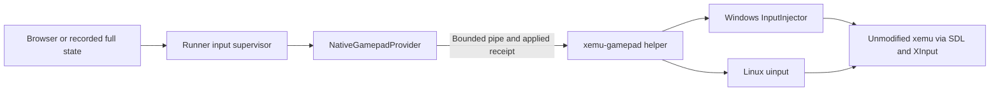

# OS gamepad input without an additional driver

Issue #65 / PR #66. This implements the controller subsystem, not the complete
browser authoring UI. There is no ViGEm/vJoy installation, custom kernel driver,
DLL replacement, injected code, special xemu build, or process-local SDL virtual
joystick. The small native helper submits input through facilities already in
the host OS. The existing lightweight `/control` keyboard path is not replaced.

## Implemented paths



The native helper and managed provider are implemented. The authoring UI and
supervisor that feed them, and the automatic queue/replay integration, remain
separate work. Neither helper nor provider loads the media/encoder subsystem.

| Host | Backend | Consumer setup |
| --- | --- | --- |
| Windows client with authorized InputInjector access | `Windows.UI.Input.Preview.Injection.InputInjector` | Set `SDL_JOYSTICK_RAWINPUT=0` on the target launch before SDL initializes |
| Linux with provisioned `/dev/uinput` and event-device access | Standard kernel `uinput` ioctls and reports | Supply the installed `linux-sdl-mapping.txt` using `SDL_GAMECONTROLLERCONFIG` at launch |
| Windows Server CI image lacking the WinRT class | Unavailable, HRESULT `80040154` | Fail preflight; do not claim a controller is connected |

**OS availability is not implied by a successful compile.** Microsoft documents
`inputInjectionBrokered` as a restricted capability. The hosted Windows client
results use the workflow's existing execution context; they do not qualify every
unelevated desktop, service/session-0 launch, package identity, Windows 10 build,
or Windows Server installation. The runner must test access in its actual
operator-provisioned session and report denial. It must not self-elevate, install
a driver, or switch to keyboard input to hide a failed analog path.

The Linux helper requires access to `/dev/uinput`; xemu needs read access to the
created event node. One-time permissions/provisioning belong to the operator,
not an automatic chmod of all host input devices. The CI udev rule applies only
to the named fixture controller on an isolated test machine.

## Why the Windows test originally failed

The OS worker accepted states and remained alive, but SDL's RawInput device was
hot-removed in the tested remote session. Direct `XInputGetState` independently
read back correct values. Selecting SDL's documented non-RawInput path before
initialization allows SDL to consume the same OS gamepad through XInput.

`NativeGamepadProvider.ConfigureTarget(ProcessStartInfo)` sets that variable for
only the selected child. It does not change global environment or replace SDL.
Apply the same effective input configuration to reference and candidate builds,
and retain it in run identity. A previously stored SDL device GUID/binding may
need a private xemu configuration binding to the selected controller; do not
silently reuse a physical controller binding or alter shared user configuration.

The Linux mapping pins the GUID observed by SDL2 and SDL3 for this exact virtual
identity. It deliberately accounts for kernel button/axis enumeration, including
X/Y button indices and trigger axes. Consumer tests use the startup environment,
not an `SDL_AddMapping` call inside a modified target.

## State and native protocol

One controller per session is implemented and qualified. Managed controller
index is 0. Unsupported count/index fails before input; four-player support is
not inferred from XInput having four slots.

Canonical state uses XInput-style button flags, byte triggers `0..255`, signed
sticks `-32768..32767`, and positive Y pointing up. The adapters explicitly
convert WGI button bits and SDL/evdev Y orientation. Windows supports all 14 core
buttons but not Guide (`0x0400`); Linux also exposes Guide. Reserved bits and
opposing D-pad directions are rejected, never silently stripped. Modern shoulder
buttons can be bound to the original Xbox Black/White controls in the target
configuration. Pressure-sensitive original Xbox face buttons and rumble are not
implemented by this state format.

A supervisor creates the helper with redirected stdin/stdout/stderr. The helper
accepts no options and creates a neutral device before emitting its ready record:

```json
{"type":"ready","protocolVersion":1,"backend":"windows-input-injector","supportedButtons":62463,"watchdogMs":250,"systemWide":true,"additionalDriver":false,"deviceSysname":""}
```

State commands use decimal, invariant-format integers:

```text
state SEQUENCE BUTTONS LEFT_TRIGGER RIGHT_TRIGGER LEFT_X LEFT_Y RIGHT_X RIGHT_Y
state 1 12288 23 254 -32768 32767 12345 -5432
stop
```

After the OS API/report write succeeds:

```json
{"type":"applied","sequence":1,"appliedAtUs":123456789}
```

Sequence must increase and fit `1..9007199254740991`; each command is at most 256
characters. The managed provider validates protocol/backend, required button
support, exact receipt sequence, and nonregressing host monotonic timestamps.
Replies are bounded to 4096 characters; the stderr tail to 8192. Startup, writes,
and receipts have deadlines; cancellation/invalid receipt kills the helper and
returns an error. Concurrent disposal waits for the same confirmed process exit.
The first provider instance cannot be reused for another device session.

**An applied receipt means successful OS submission, not that xemu polled it or
that the game acted on it.** Media frame counts do not strengthen that claim.
Gameplay activation still needs the runner's separate replay/progress and
checkpoint qualification. Native timestamps are the worker's monotonic clock;
record its session/clock identity and do not subtract browser timestamps from
it without explicit clock correlation.

## Freshness, holds, and teardown

```text
fresh full state -> validate -> OS apply -> timestamp -> matching receipt
        |
        +-- no next valid state for 250 ms
                -> neutralize -> remove device -> fail session
```

The native device thread owns the watchdog independently of pipe IO. After the
first state, send fresh full-state snapshots at a cadence such as 25–50 ms,
including unchanged states while holding controls. Before the first state the
device remains neutral; launch/initialization can complete without a fabricated
press. `stop`, stdin EOF, malformed or stale commands, partial-line timeout and
process death remove the device. Output-pipe blockage must not hold a gamepad
indefinitely: the device thread expires even if receipt output is blocked.

The managed provider does **not** autonomously replay the last state forever.
For browser control, only fresh browser samples may refresh its lease; a dead
browser must not be concealed by server-generated heartbeats. For deterministic
replay, the replay scheduler intentionally re-applies the held state while its
time/frame requirements are pending, under its own test timeout. These hold
refreshes need not become duplicate timeline transitions. Explicit neutralization
and disposal are still required on normal exit, cancellation or media failure.

This is an OS-visible gamepad, **not PID-confined injection**. Other applications
that poll gamepads in the same session can see it. Acquire exclusive runner
ownership before device creation; select/bind the intended controller in xemu and
avoid simultaneous unrelated interactive applications. Pointer input has its own
process/window targeting rules and must not inherit a claim of gamepad isolation.

## Managed use

```csharp
await using var gamepad = new NativeGamepadProvider(
    Path.GetFullPath(Path.Combine("tools", OperatingSystem.IsWindows()
        ? "xemu-gamepad.exe" : "xemu-gamepad")));

var launch = new ProcessStartInfo(xemuExecutable) { UseShellExecute = false };
gamepad.ConfigureTarget(launch); // Record effective SDL settings with the run.
await gamepad.CreateAsync(1, cancellationToken); // Before xemu enumerates devices.
using var xemu = Process.Start(launch)
    ?? throw new IOException("xemu did not launch");

// Feed only authorized, fresh states; refresh holds from the appropriate owner.
await gamepad.ApplyStateAsync(0, controllerState, cancellationToken);
NativeGamepadReceipt? receipt = gamepad.LastApplied;
// The session loop, recording, xemu lifetime and lease belong to the supervisor.
await gamepad.NeutralizeAsync(cancellationToken);
```

`IsAvailable` only means the helper file exists. `IsReady` means its native
handshake succeeded and it is still running, not that the whole authoring session
or target binding has been qualified. Retain the helper hash, OS/backend,
controller mapping/configuration, effective environment and actual receipts.

## Build and qualification

Windows: Visual Studio C++ workload and Windows SDK C++/WinRT. No third-party
controller driver is built. The helper uses the static MSVC runtime.

```powershell
cmake -S native/gamepad -B gamepad-build -A x64
cmake --build gamepad-build --config Release
ctest --test-dir gamepad-build -C Release --output-on-failure
cmake --install gamepad-build --config Release --prefix out/gamepad
```

Linux: C++20 compiler, standard kernel headers, CMake and threads:

```sh
cmake -S native/gamepad -B gamepad-build -DCMAKE_BUILD_TYPE=Release
cmake --build gamepad-build
ctest --test-dir gamepad-build --output-on-failure
cmake --install gamepad-build --prefix out/gamepad
```

Install the `tools` directory beside the runner. On Linux, keep the mapping file
beside the helper. Copying only the exe and forgetting its configuration is not a
valid installation. Native artifacts and managed process tests are separate from
ordinary runner self-contained publishes at this stage.

The `authoring-gamepad` workflow builds the real native code and uses independent
XInput/SDL consumers. Positive hosts are Linux x64 and Windows 11 ARM64, plus
Windows x64 programs under Windows 11 ARM emulation. Do not describe the latter
as native x64 hardware qualification. Windows Server's explicit unavailable test
is a negative capability result, not working input.

For a provisioned host with no other controllers:

```sh
# Set SDL2_LIBRARY / SDL3_LIBRARY when libraries are not in system search paths.
# On Windows additionally set SDL_JOYSTICK_RAWINPUT=0 before these tests.
python tests/gamepad/check_os_gamepad.py /absolute/path/to/xemu-gamepad
python tests/gamepad/check_sdl3.py /absolute/path/to/xemu-gamepad
# Windows-only, independent of SDL:
python tests/gamepad/check_xinput.py C:/absolute/path/to/xemu-gamepad.exe
# Actual managed source, subprocess pipe fixtures (NOT OS readback):
dotnet run --project tests/GamepadProviderChecks -c Release
```

Tests individually verify every core button, simultaneous analog states, neutral,
and removal while A, both triggers and both sticks were held. Teardown cases:
normal stop, 250ms freshness loss, invalid state, kill, EOF, incomplete command,
stale sequence and blocked receipt output. JSON records retain backend, processes,
SDL identity/mapping, requested case and receipt. The managed suite separately
covers native startup denial, malformed/oversized/stale receipts, cancellation,
timeout, stderr flooding and concurrent cleanup. No fixture result alone is
advertised as actual gamepad or xemu gameplay qualification.

Actual xemu bindings/gameplay, unelevated Windows deployment, Windows 10 and
native x64 Windows hardware still require explicit target qualification. The
complete feature retains its independent queue/session, HTTPS, browser UI,
recording/replay/publishing and mouse-control gates.

## Primary references

- [Microsoft InputInjector gamepad initialization and restricted capability](https://learn.microsoft.com/en-us/uwp/api/windows.ui.input.preview.injection.inputinjector.initializegamepadinjection)
- [Linux kernel uinput interface](https://docs.kernel.org/input/uinput.html)
- [SDL2 RawInput hint](https://wiki.libsdl.org/SDL2/SDL_HINT_JOYSTICK_RAWINPUT)
- [SDL3 RawInput hint](https://wiki.libsdl.org/SDL3/SDL_HINT_JOYSTICK_RAWINPUT)
- [Pinned SDL RawInput remote-session handling](https://github.com/libsdl-org/SDL/blob/877399b2b2cf21e67554ed9046410f268ce1d1b2/src/joystick/windows/SDL_rawinputjoystick.c)
