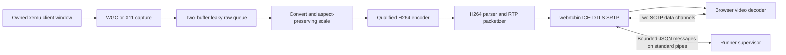

# Real-time authoring media

Related: [issue #65](https://github.com/Mainkill1/Xemu-Test-Runner/issues/65) and
[draft PR #66](https://github.com/Mainkill1/Xemu-Test-Runner/pull/66).

This is the implemented native **media subsystem**, not a claim that the complete
Test Authoring UI, HTTPS host, virtual gamepad or queue integration is finished.
The worker sends actual H.264 over WebRTC and carries two browser data channels.
It is not a screenshot server. The existing explicit one-shot PNG command is
separate and is never invoked to recover a failed stream.

## Concrete architecture



The supervisor supplies one process/window identity, exchanges SDP/ICE, drains
stdout/stderr, and owns the worker's shutdown deadline. No native media process
is added to the normal runner startup or test execution path by this change.

The implemented sources are an explicitly selected Windows client window using
Windows Graphics Capture and a local X11 window using `ximagesrc`. A synthetic
source is available only with explicit `--fixture`. Window/root ID zero is
refused. Linux requires a local X11 display; **Wayland/PipeWire is not implemented
by this worker yet**. There is no automatic whole-desktop capture fallback.

Windows WGC code is distinct from the software encode/transport fixture; a green
Windows fixture is not real desktop/WGC, driver, or xemu qualification.

## Encoder selection

The worker has concrete configurations, not placeholder provider interfaces:

| Selection | GStreamer factory | Input | Qualification status |
| --- | --- | --- | --- |
| `x264` | `x264enc` | I420 | Exercised by real software/browser fixtures |
| `nvenc` | `nvh264enc` | NV12 | Requires NVIDIA host/driver qualification |
| `qsv` | `qsvh264enc` | NV12 | Requires Intel host/driver qualification |
| `amf` | `amfh264enc` | NV12 | Requires AMD/Windows host qualification |
| `vaapi` | `vah264enc` | NV12 | Requires Linux VA driver qualification |

`auto` tries the hardware configurations in table implementation order (NVENC,
QSV, AMF, VA), then x264. Explicit selection never silently substitutes another
encoder. Every candidate must actually encode 120 frames through the same
conversion, encoder and parser fragment used by the live stream. Missing plugins,
unsupported properties, driver initialization, negotiation errors, empty output,
or a probe deadline fail that candidate. Reasons remain visible on stderr.

The probe requires 120 encoded access units, nonzero bytes and at least 55 FPS of
**unpaced synthetic encode capacity**, with an eight-second wait limit per
candidate. This is not a game workload benchmark, hardware certification, live
60 FPS proof, or a browser latency measurement. Full media qualification still
requires the receiving browser. `--list-encoders` reports installation, never
qualification; `--probe` does real work and must hold the authoring lease.

Presets disable B frames and lookahead. x264 uses `zerolatency`, `ultrafast`,
sliced threads, a one-second keyframe interval and a 100 ms VBV setting. Hardware
presets request CBR and applicable low-latency modes. Properties are not removed
on failure just to produce a passing probe.

Defaults are 1280x720, 60 FPS, 6000 kbit/s. 1920x1080 is selectable. The bitrate
range is 500..30000 kbit/s. Scaling preserves aspect ratio and adds borders.
The current path explicitly reports **system-memory**: WGC downloads before
conversion. Hardware encoding here does not imply a zero-copy capture path.

Only the raw queue is leaky, with a maximum of two frames. There is no leaky
encoded-frame queue that could discard H.264 reference pictures. The parser
outputs byte-stream/access-unit-aligned constrained-baseline H.264. RTP uses a
1200-byte MTU, zero-latency aggregation and SPS/PPS at IDRs. The payloader's RTP
payload and transceiver caps are set from the browser's compatible offer, not
hard-coded to 96.

## Build and dependencies

CMake 3.20+, a C11 compiler, pkg-config, GStreamer 1.24+ development/runtime
packages, JSON-GLib and the required runtime plugins are needed. Linux also
needs X11 development libraries. Required plugin functionality includes capture,
video conversion/scaling, an encoder, H.264 parsing/RTP, WebRTC, Nice, DTLS and
SCTP. Missing requirements fail; they do not select screenshot mode.

```sh
cmake -S native/authoring -B native-build -G Ninja -DCMAKE_BUILD_TYPE=Release
cmake --build native-build
native-build/xemu-authoring-media --list-encoders
native-build/xemu-authoring-media --probe --encoder x264 --resolution 1280x720
```

Ubuntu CI installs `libgstreamer1.0-dev`, `libgstreamer-plugins-bad1.0-dev`,
`libjson-glib-dev`, `libx11-dev`, GStreamer good/bad/ugly plugins and
`gstreamer1.0-nice`. Windows CI builds a native UCRT64 executable with MSYS2's
GStreamer development/runtime packages. See the exact commands in
[authoring-native.yml](../.github/workflows/authoring-native.yml).

This does not add a GStreamer runtime bundle to the ordinary runner release.
Distribution must retain and review the licenses for the selected runtime,
plugins, codec libraries and drivers. The native source's MIT header does not
relicense third-party encoders. In particular, review x264's own licensing before
shipping a package containing it; choosing another backend is not permission to
silently downgrade media quality.

## CLI and control protocol

Example target invocation (window handles are hexadecimal, PIDs decimal):

```text
xemu-authoring-media --window 001A0F4C --pid 18344 --encoder auto --resolution 1280x720 --bitrate-kbps 6000
```

The process uses newline-delimited JSON on stdin/stdout; diagnostic text goes to
stderr. A line is capped at 1 MiB, an SDP at 256 KiB, an ICE candidate at 8 KiB,
early ICE at 128 entries, and a controller/channel string at 4096 bytes. The native
command backlog is bounded to 128 entries and 2 MiB, with an explicit failure on
overload. The supervisor must continuously drain both pipes and bound its own
queues; native limits do not complete supervisor backpressure handling.

Startup returns:

```json
{"type":"ready","protocolVersion":1,"stage":"signaling-ready","encoder":"x264","hardware":false,"memoryPath":"system-memory","sourceWidth":1280,"sourceHeight":720,"surfaceVersion":1,"width":1280,"height":720,"fps":60,"bitrateKbps":6000,"browserQualified":false}
```

**`ready` means signaling-ready only.** The synthetic encoder probe has completed,
but the target pipeline stays in READY until a compatible offer. It does not
start continuously capturing/encoding while waiting for an offer. Neither an
open peer nor increasing encoder counters is sufficient to enable recording.

Browser integration creates one recvonly video transceiver first and the data
channels second. The current protocol accepts that two-m-line layout and one
initial offer; audio tracks and in-place renegotiation are not implemented.
Media currently uses direct ICE connectivity; a TURN relay or STUN server is not
configured by this worker. HTTPS protects the future signaling origin, not the
separate UDP media transport.
Select constrained-baseline H.264 with packetization-mode=1. Offers that do not
provide the supported video codec are rejected instead of opening data-only.

```json
{"type":"offer","sdp":"<browser SDP>"}
{"type":"ice","sdpMLineIndex":0,"candidate":"<browser ICE candidate>"}
{"type":"bitrate","bitrateKbps":3000}
{"type":"keyframe"}
{"type":"send","data":"<supervisor application message>"}
{"type":"stop"}
```

Worker replies include `answer`, trickled `ice`, `channel-open`, `data`,
`encoder-config`, `keyframe-requested`, `health`, `surface-changed`, and `error`.
Only one controlling browser is represented. Channels must be exactly:

```javascript
peer.createDataChannel('input-state', { ordered: false, maxRetransmits: 0 });
peer.createDataChannel('session-control', { ordered: true });
```

Channel callbacks are attached during `prepare-data-channel`, but labels and
reliability are checked during `on-data-channel`, after DCEP metadata exists.
Unknown, duplicate or incorrectly configured channels fail the media session.
A successful channel echo means **transport delivery**, not virtual-device
application or guest acknowledgment. The recorder must not mark an echo as
applied input.

Early ICE is queued until the remote description is accepted. The handshake
limit defaults to 15000 ms and can be set with `--handshake-timeout-ms` in
100..60000. The watchdog runs once per second; that polling granularity applies
to deadline enforcement. Peer/channel loss ends the session rather than silently
reconnecting into a recording. Exit code 0 is an explicit normal stop; invalid
CLI/target arguments return 2; media/protocol failure returns 3.

Live bitrate changes require a backend property marked mutable while PLAYING.
Unsupported changes fail explicitly. Keyframe requests use an upstream force-key
unit event. Automatic network congestion adaptation is **not** implemented by
this command API and must not be inferred from having a bitrate setter.

## Health, frame identity, and window coordinates

Once per second, health reports capture samples, encoder input samples, encoded
access units/bytes/keyframes, capture/encode FPS, measured encoded kbit/s, target
bitrate, last sample ages, peer status, geometry, surface version and a host
monotonic timestamp.

**Capture samples, encoded frames and browser decoded frames are not guest frame
progress.** A compositor can repeat frames, and a game may intentionally render
at 30 FPS while the transport runs at 60 FPS. None of these counters proves that
xemu sampled a controller state. Replay's frame-progress observer remains a
separate requirement; the supervisor must not reuse media counters as that proof.

A CAPS geometry change produces `surface-changed` before new-geometry capture
buffers are forwarded, incrementing `surfaceVersion`. Encoded output keeps the
selected size while its content rectangle changes. The pointer owner must
invalidate stale coordinates and bind new actions to the new version. The native
media worker does not itself move a mouse or neutralize a gamepad.

For a source `sw` by `sh` contained in an encoded image `vw` by `vh`:

```text
scale = min(vw/sw, vh/sh)
contentWidth = sw*scale; contentHeight = sh*scale
offsetX = (vw-contentWidth)/2; offsetY = (vh-contentHeight)/2
```

Reject clicks outside that rectangle. Convert the remaining point to the source
0..10000 grid, then resolve against the currently verified native client surface.
This avoids treating letterbox bars as xemu window coordinates. A new window or
process requires a new supervised session; size-change notification is not
permission to substitute another target.

## Executable qualification

Use an H.264-capable Chrome/Chromium build. The first CI failure was a
codec-stripped Playwright headless shell; the test deliberately fails when H.264
is absent instead of switching to VP8 or PNG.

```sh
python -m pip install playwright==1.55.0
python -m playwright install --with-deps chrome
python tests/native/check_media_worker.py native-build/xemu-authoring-media
python tests/native/check_encoder.py native-build/xemu-authoring-media
python tests/native/check_protocol.py native-build/xemu-authoring-media
python tests/native/check_webrtc.py native-build/xemu-authoring-media --payload 125 --early-ice
python tests/native/check_webrtc.py native-build/xemu-authoring-media --resolution 1920x1080 --peer-close
python tests/native/check_webrtc.py native-build/xemu-authoring-media --no-h264
python tests/native/check_webrtc.py native-build/xemu-authoring-media --bad-channel
xvfb-run -a python tests/native/check_webrtc.py native-build/xemu-authoring-media --x11-window
```

`CHROMIUM_EXECUTABLE` selects an installed H.264-capable browser for local checks.
The tests embed the receiver page through Playwright and forward SDP through the
fixture supervisor. The actual worker, encoder, ICE, DTLS/SRTP, decoder and SCTP
channels run; no production signaling or HTTPS claim is implied.

Positive tests require both data channels, exact analog payload delivery,
changing decoded pixels, correct dimensions/codec/payload, live bitrate change,
keyframes and at least 55 measured decoded FPS across five seconds. The X11 test
captures a real owned animated window, checks 4:3 letterboxing, resizes to 800x450,
and requires a new source surface version. Negative tests cover wrong JSON types
(previously a native crash), incompatible codecs/channels, missing peer, pending
ICE bounds, command-flood refusal, forbidden root capture and shutdown.

The window fixture also paints a binary frame ID and its complement. Decoding
that barcode from the browser video pairs the image with the fixture's host
paint timestamp. The test requires 30+ distinct samples and p95 below 150 ms.
It measures **paint-submission to decoded-observation including the return trip
through Playwright**, on one host clock. This is not physical display latency,
remote LAN qualification, or gamepad-to-game-response latency.

Representative local Linux results (GStreamer 1.26.2, Chromium 144, x264):

| Fixture | Decoded FPS over five seconds | Observation |
| --- | ---: | --- |
| 720p, negotiated payload 125, early ICE | 61.14 | Both data channels and live controls passed |
| 1080p, browser disconnect | 60.73 | Video passed; loss caused explicit worker failure |
| Owned X11 window, resize and visual barcode | 60.14 | 73 distinct latency samples; median 37.75 ms, p95 49.98 ms |

Small windows can measure slightly above nominal 60 due to stats sampling and
buffer boundaries; this is not an unlocked game FPS claim. Retained CI artifacts
contain exact source commit, GStreamer/browser versions and check logs. Hardware
backends, actual WGC, Wayland, sustained complex game scenes, CPU/GPU interference,
packet-loss/congestion scenarios and physical LAN input-to-display latency still
need dedicated qualification.

## Supervisor integration must preserve these boundaries

Acquire exclusive authoring ownership **before** launching a worker or an encoder
probe. Refuse this entire subsystem during ordinary queued execution, benchmark,
diagnostic, campaign and replay work. Do not add a job-level override. A GET for
normal runner status must not start an encoder or perform a probe.

Use the dedicated trusted HTTPS authoring origin for browser signaling, ownership
and tokens. Do not expose the native stdin protocol as an unauthenticated remote
process-launch API. Keep the existing `/control` screenshot/recovery path separate.
After media fault, revoke input, neutralize native devices, retain the fault and
invalidate the recording segment. Worker disconnect alone cannot do those things
until the supervisor is wired to the input/recorder lifecycle.

## Primary implementation references

- [GStreamer webrtcbin signals and signaling](https://gstreamer.freedesktop.org/documentation/webrtc/)
- [H.264 RTP aggregation/configuration](https://gstreamer.freedesktop.org/documentation/rtp/rtph264pay.html)
- [x264 latency settings](https://gstreamer.freedesktop.org/documentation/x264/index.html)
- [NVENC](https://gstreamer.freedesktop.org/documentation/nvcodec/nvh264enc.html), [QSV](https://gstreamer.freedesktop.org/documentation/qsv/qsvh264enc.html), [AMF](https://gstreamer.freedesktop.org/documentation/amfcodec/amfh264enc.html), [VA](https://gstreamer.freedesktop.org/documentation/va/vah264enc.html)
- [Windows capture client-area support](https://gstreamer.freedesktop.org/documentation/d3d11/d3d11screencapturesrc.html)
- [x264 licensing](https://www.videolan.org/developers/x264.html)
