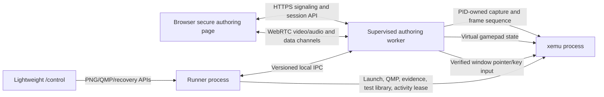
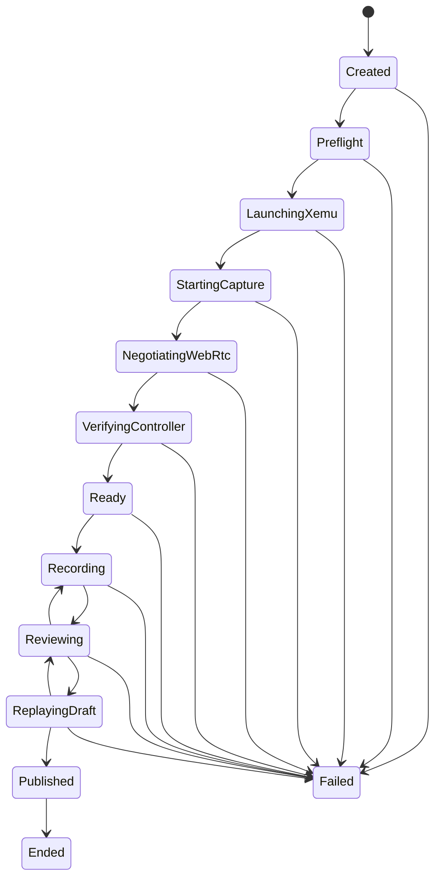

# Real-time test authoring design

**Status:** Draft architecture for issue #65. Phase 0 establishes contracts and executable checks without changing runner behavior.

## Decision summary

The runner will gain a dedicated **Test Authoring** operating path for creating reproducible game tests through a playable browser stream. It will use a supervised worker for capture, encoding, WebRTC, native virtual-controller state, frame sequencing, and xemu-owned window automation. The existing lightweight `/control` path remains the recovery and observation tool and does not start a continuous media pipeline.

Normal test execution and Test Authoring are mutually exclusive runner activities. Real-time media is prohibited during queued execution and automated replay. A stream that cannot meet the readiness contract blocks authoring instead of falling back to screenshot polling.

## Context

The current runner can capture direct screenshots, expose a periodically refreshed PNG preview, send logical Xbox buttons through configured host keys, record discrete `JobStep` actions, and publish immutable test definitions. Those capabilities are useful for smoke procedures and remote recovery, but they cannot author a game sequence that depends on continuous visibility, analog sticks, triggers, simultaneous controls, frame progress, or xemu host-window interaction.

The authoring system must create tests against ordinary and historical xemu builds. It cannot require a patched emulator protocol. It must also preserve the integrity of performance and correctness testing by keeping the media stack out of ordinary execution.

## Goals

- Create a new test through a browser without manually writing the complete `JobDefinition` JSON.
- Stream the owned xemu window at a qualified playable rate and latency.
- Read a physical browser gamepad and inject complete Xbox-compatible state into xemu.
- Record input after successful host application, including host monotonic time and presented-frame sequence.
- Express each hold/wait using both a minimum elapsed time and minimum presented frames.
- Control verified xemu-owned host windows using a visible 0-10000 X/Y grid, pointer actions, scrolling, dragging, and host key chords.
- Replay a draft without WebRTC or a connected browser.
- Publish an immutable saved-test revision only after validation.
- Keep `/control` lightweight for viewing, screenshots, pause/resume, emergency input, and recovery.
- Refuse authoring media while queued execution owns the runner.

## Non-goals

- Replacing `/control`, `/results`, requested tests, campaigns, or the existing evidence pipeline.
- Treating decoded WebRTC frames as correctness evidence.
- Streaming every automated test.
- Exposing the authoring worker directly to the public internet.
- Selecting a Windows virtual-gamepad driver before deployment, licensing, support, and maintenance qualification.
- Requiring xemu source changes.
- Automatically publishing or starting a test because a recording stopped.

## Operating model

The runner has two mutually exclusive activity leases:

```text
Idle
  ├── TestExecution
  └── TestAuthoring
```

`TestExecution` covers queue-owned smoke, benchmark, diagnostic, requested-test, XISO/campaign, and automated replay work. `TestAuthoring` covers one interactive authoring session. Lightweight recovery is not a third executor; it is a policy-controlled action against the currently owned target.

Rules:

- A queued test arriving during authoring remains queued and reports that the authoring lease is active.
- An authoring request during execution is rejected with `authoring_stream_blocked`.
- An authoring session never attaches itself to an already-running queued test.
- The activity lease is process-local, token-protected, and released exactly once.
- A stale/disposed lease cannot release a newer owner.
- No `AllowRealtimeStream` job override is added.

## Component boundaries



### Runner process

Owns:

- activity authorization and lease state;
- xemu process identity and lifecycle;
- source application/test selection;
- immutable saved-test publication;
- normal evidence and result storage;
- worker supervision and local IPC authorization;
- refusal of media while execution owns the runner.

The runner never trusts a worker-reported PID, window, or session identifier without matching it to the process/session it owns.

### Authoring worker

Owns:

- dedicated HTTPS authoring origin;
- capture-source discovery and PID/window binding;
- frame capture and frame sequence;
- low-latency encoder and WebRTC peer;
- browser controller transport;
- native virtual gamepad provider;
- xemu-owned window pointer/key provider;
- applied input acknowledgements;
- authoring health metrics and failure neutralization.

A worker crash fails the authoring session and neutralizes input but does not terminate the runner service or silently resume recording.

### Browser

Owns:

- secure-context validation;
- physical Gamepad API polling and mapping display;
- complete controller-state transmission;
- video decode/render and decode statistics;
- timeline/editor interaction;
- pointer-grid projection over the current source surface;
- explicit record, pause, replay, publish, and end commands.

The browser does not decide that an input was applied. It receives authoritative acknowledgements from the worker.

## Authoring session state



An operator may end a nonterminal session. Normal transitions are validated by a state machine; callers cannot assign arbitrary state strings.

`Ready` is a hard gate. It requires:

- owned xemu process alive;
- QMP ready;
- capture source bound to the owned PID;
- source surface version known;
- capture and encode rates above the configured floor;
- browser receiving and decoding media;
- `input-state` data channel open;
- `session-control` data channel open;
- native virtual gamepad created and accepting a neutral probe;
- presented-frame sequence progressing;
- input age/round-trip within the configured maximum;
- browser secure context and active standard gamepad mapping.

A readiness failure reports all unmet requirements. It never changes the session to Ready with a warning.

## HTTPS and session authorization

The authoring UI is served from a dedicated Kestrel HTTPS endpoint, initially on a separate configurable port. This avoids replacing the current embedded HTTP server during the first delivery and keeps ordinary control lightweight.

Configuration provides:

- bind address;
- HTTPS port;
- certificate source;
- certificate path or Windows certificate-store selector;
- password environment-variable name when a PFX requires a password;
- advertised authoring origin;
- join-token lifetime;
- maximum request and signaling sizes.

Rules:

- no HTTP downgrade;
- certificate secrets are not stored in `runner.json`;
- the runner creates a single-use, short-lived join token bound to one authoring session;
- cookies/tokens are secure and scoped to the authoring origin;
- signaling requests must match the active session and join token;
- the default LAN bind does not imply internet-grade authentication or exposure.

The existing HTTP UI may link to the HTTPS authoring origin. Authoring API calls remain same-origin with the HTTPS worker.

## Worker supervision and IPC

The runner launches one worker per authoring session or one supervised worker hosting one active session; the first implementation may choose either as long as only one authoring lease exists.

The IPC protocol is:

- local named pipe on Windows and Unix-domain socket on Linux;
- versioned envelope;
- length-prefixed and maximum-size bounded;
- request/response correlation ID;
- cancellation-aware;
- explicit event sequence;
- no shell command transport;
- authenticated by an unguessable per-launch secret passed through a protected inherited channel or environment limited to the child;
- closed when the runner ends the session.

Core messages:

```text
Runner -> Worker
  StartSession
  BindTarget
  BeginRecording
  PauseRecording
  AddMarker
  ReplayDraft
  PublishAccepted
  EndSession

Worker -> Runner
  CapabilityReport
  StateChanged
  SurfaceChanged
  MediaHealth
  ControllerHealth
  AppliedControllerState
  AppliedWindowAction
  SegmentInvalidated
  DraftSnapshot
  Failure
```

The worker cannot publish a saved test directly. It submits a validated draft to the runner, which freezes identities and writes the immutable revision.

## Media pipeline

### Required profile

- source/encode target: 1280x720 at 60 FPS;
- default readiness floor: 55 captured, encoded, and decoded FPS over a five-second window;
- LAN glass-to-glass target: below 150 ms;
- H.264 low-latency configuration;
- 1080p60 only after host capability qualification;
- no B-frame/reorder configuration that introduces avoidable authoring latency;
- no media recording by default.

The worker reports:

- source dimensions and surface version;
- captured, encoded, sent, received, and decoded frame counters/rates;
- dropped frames by stage;
- encoder backend and hardware/software status;
- bitrate;
- packet loss;
- peer RTT;
- latest frame age;
- last surface change;
- readiness floor violations.

Hardware and software encoders are interchangeable backends only when they satisfy the same contract. An unavailable encoder or a rate below the floor produces `AUTHORING_MEDIA_UNAVAILABLE`.

### Windows capture

Use `Windows.Graphics.Capture` against a window resolved from the owned xemu PID. The implementation must process frame-arrival timestamps, content-size changes, closed items, D3D device loss, and frame-pool recreation. The capture source publishes a monotonically increasing `surfaceVersion` whenever coordinate mapping may have changed.

### Linux capture

- X11: capture the verified xemu window rather than the full desktop.
- Wayland/Steam Deck: use the XDG ScreenCast/PipeWire session contract and bind the returned stream to the selected source. Prefer stable PipeWire serial targeting when available.
- The authoring capability report must state whether user portal selection/consent is required.

### Frame progress without media

Automated replay starts only a lightweight frame-progress observer. It must not start encoding, WebRTC, audio, or a browser peer. The observer exposes a presented-frame counter and timestamp sufficient to enforce input timing. If a platform cannot provide qualified frame progress, replay reports an unsupported capability rather than substituting wall time.

## WebRTC transport

The peer carries video and two data channels:

```text
input-state
  ordered = false
  maxRetransmits = 0
  complete state snapshots
  newest sequence supersedes older state

session-control
  ordered = true
  reliable
  commands, acknowledgements, markers, health, errors
```

The complete `input-state` packet prevents a lost release event from leaving a control held. The worker rejects:

- duplicate or older sequence numbers;
- invalid controller index;
- malformed state size;
- stale browser timestamp beyond the configured age;
- packets received before Ready or after recording/session failure.

A periodic full-state heartbeat is sent even when no control changed. Browser hidden/lost focus, gamepad disconnect, channel close, heartbeat timeout, or worker error immediately neutralizes virtual input.

The concrete media/WebRTC library is selected in Phase 3 through a qualification gate. It must be distributable with the repository's Windows/Linux self-contained artifacts, use an acceptable license, support H.264 media plus data channels, expose required statistics, and remain maintainable. Phase 0 intentionally introduces no media dependency.

## Controller model

The browser sends fixed-width complete Xbox-compatible state:

```csharp
public readonly record struct XboxControllerState(
    XboxControllerButtons Buttons,
    byte LeftTrigger,
    byte RightTrigger,
    short LeftX,
    short LeftY,
    short RightX,
    short RightY);
```

The provider contract is:

```csharp
public interface IXemuGamepadProvider : IAsyncDisposable
{
    string Name { get; }
    bool IsAvailable { get; }
    Task CreateAsync(int controllerCount, CancellationToken cancellationToken);
    Task ApplyStateAsync(
        int controllerIndex,
        XboxControllerState state,
        CancellationToken cancellationToken);
    Task NeutralizeAsync(CancellationToken cancellationToken);
}
```

The device is created before xemu starts so SDL enumerates it during launch.

Platform direction:

- Windows: qualified Xbox-compatible virtual HID/gamepad backend;
- Linux/Steam Deck: uinput/libevdev-backed virtual gamepad;
- keyboard mapping remains available to existing discrete tests but cannot satisfy authoring readiness.

The Windows backend selection is deferred until it passes driver installation, Windows 10/11, reboot, self-contained distribution, license, and maintenance review. Failure to qualify a backend blocks the feature.

## Applied input trace and replay

The authoritative record is created after the virtual provider accepts a state:

```json
{
  "sequence": 184,
  "appliedAtUs": 7912550,
  "presentedFrame": 418,
  "controllerIndex": 0,
  "state": {
    "buttons": 4096,
    "leftTrigger": 0,
    "rightTrigger": 255,
    "leftX": 8140,
    "leftY": -32768,
    "rightX": 0,
    "rightY": 0
  },
  "minimumElapsedMs": 250,
  "minimumPresentedFrames": 15,
  "timeoutMs": 5000
}
```

Replay advances when both are true:

```text
elapsed since application >= minimumElapsedMs
presented frames since application >= minimumPresentedFrames
```

A timeout before both conditions are satisfied produces `INPUT_FRAME_PROGRESS_TIMEOUT` with expected and observed values. Replay never converts the condition to `time OR frames` and never drops the frame requirement after a freeze.

Controller transitions may be coalesced while recording only when doing so preserves the exact applied-state history required by replay. Neutral states and state changes at marker/screenshot/segment boundaries are never discarded.

## Xemu-owned window automation

Host-window automation is separate from guest-controller state. It supports older xemu versions and xemu chrome actions such as snapshot, reload, reset, configuration, and modal dialogs.

### Target model

A target selector chooses:

- `main-window`;
- `active-owned-window`;
- explicit current `windowId`.

Each resolved surface contains:

- process ID;
- platform window ID;
- title;
- client width/height;
- screen/client origin where applicable;
- DPI scale;
- visibility/minimized/foreground state;
- surface version.

Before every action the provider:

1. enumerates visible top-level windows owned by the expected PID;
2. resolves the selector;
3. rejects unrelated windows;
4. restores and foregrounds the target;
5. verifies foreground acquisition;
6. re-reads client bounds, DPI, and surface version;
7. rejects a stale expected surface version;
8. maps the grid coordinate to the current client rectangle;
9. applies the action;
10. returns requested and actual coordinates plus target identity.

### Coordinate model

The browser and persisted action use an integer 0-10000 grid per axis. Mapping is inclusive:

```text
0     -> first client pixel
10000 -> last client pixel
```

For a 1920x1080 client surface, grid `(5142, 837)` maps to pixel `(987, 90)` using nearest-pixel rounding.

The grid is relative to the source client surface, not the browser element, monitor, or desktop. Browser letterboxing/cropping is removed before producing the grid coordinate.

### Commands

Supported commands:

- move;
- click;
- double click;
- button down;
- button up;
- drag path;
- wheel scroll;
- host key chord.

Pointer/button state is neutralized on surface change, browser loss, session failure, or worker shutdown. A drag cannot continue across a surface-version change.

### Lightweight `/control` integration

The same verified provider is later exposed on `/control` against a direct/static image. The preview response carries target window ID, dimensions, and surface version. A click from an older surface version is rejected with `stale_window_surface`, and the UI refreshes the image. These actions remain governed by `AllowManualInput` and are logged as operator intervention.

## Draft and publication model

Authoring uses a mutable draft separate from `JobDefinition`. The draft contains:

- source application and saved-test identities;
- launch/runtime-state selections;
- applied controller samples;
- window actions and key chords;
- waits and frame requirements;
- markers and measurement segments;
- direct screenshot checkpoints;
- validation failures and invalidated ranges;
- authoring environment/capability summary.

The timeline editor may simplify/coalesce events, but all transformations are explicit and reversible until publication.

Publishing requires:

- authoring state `ReplayingDraft` completed successfully;
- no invalid segment;
- source identities frozen;
- referenced files/hashes resolved;
- generated plan validated by normal `JobDefinition` validation;
- an explicit name/description and publish action.

Publishing writes a new immutable saved-test revision. It does not submit or start a run.

## Public API outline

The existing control server exposes discovery/lifecycle integration, while signaling and authoring UI are served by the secure worker origin.

Runner-side routes:

```text
GET    /api/v1/authoring/status
POST   /api/v1/authoring/sessions
GET    /api/v1/authoring/sessions/{id}
POST   /api/v1/authoring/sessions/{id}/end
```

Secure authoring-origin routes:

```text
GET    /api/v1/authoring/capabilities
GET    /api/v1/authoring/sessions/{id}
POST   /api/v1/authoring/sessions/{id}/webrtc/offer
POST   /api/v1/authoring/sessions/{id}/webrtc/candidate
POST   /api/v1/authoring/sessions/{id}/record/start
POST   /api/v1/authoring/sessions/{id}/record/pause
POST   /api/v1/authoring/sessions/{id}/markers
POST   /api/v1/authoring/sessions/{id}/window/actions
POST   /api/v1/authoring/sessions/{id}/replay
POST   /api/v1/authoring/sessions/{id}/publish
GET    /api/v1/authoring/sessions/{id}/events
```

Exact route placement can change when the worker host is implemented, but the security boundary, lifecycle ownership, and no-media execution rule do not.

## Failure model

Stable error codes include:

```text
authoring_busy
authoring_stream_blocked
authoring_https_unavailable
authoring_join_token_invalid
authoring_worker_failed
authoring_media_unavailable
authoring_capture_target_invalid
authoring_surface_changed
authoring_controller_unavailable
authoring_controller_stale
authoring_frame_progress_unavailable
input_frame_progress_timeout
stale_window_surface
window_target_not_owned
window_foreground_rejected
```

While Recording, any loss of authoritative input/media state performs this sequence:

1. neutralize virtual gamepad and pointer buttons;
2. stop accepting input packets;
3. close or quarantine the current recording segment;
4. mark the segment invalid with timestamp/frame range and reason;
5. retain media/controller/worker diagnostics;
6. move the session to Failed, or to Reviewing only for explicitly recoverable conditions defined by a later implementation plan.

The first implementation treats transport, virtual-device, target-identity, and frame-observer loss as session failure. It does not silently recover and continue the same segment.

## Evidence and observability

WebRTC frames are operational media only. They are not persisted as screenshot evidence, compared for correctness, or used as benchmark input.

Authoring evidence contains:

- session configuration and capability report;
- worker/runner versions;
- target process identity;
- state transitions;
- surface changes;
- capture/encode/decode/network metrics;
- browser/controller mapping details without unrelated device secrets;
- applied controller and window-action acknowledgements;
- invalidated segments;
- direct screenshots explicitly requested by the author;
- replay validation result;
- published revision identity when applicable.

Normal execution records whether an unexpected remote operator action occurred. A window/controller action included in the published plan is expected test input; a `/control` action during execution is intervention.

## Security and safety boundaries

- Only windows owned by the runner-owned xemu PID are eligible by default.
- Operating-system dialogs owned by other processes require a future explicit allowlist and are outside the initial provider contract.
- No arbitrary desktop coordinate injection.
- No arbitrary command execution through IPC or browser routes.
- Request bodies, SDP/candidates, event queues, trace lengths, and pointer paths are bounded.
- All held buttons are released on cancellation/disposal.
- Session tokens are short-lived, single-use, and bound to one session.
- The LAN deployment remains a trusted-network model until a separate authentication design changes it.

## Platform qualification

### Windows

- Windows 10 and 11;
- `Windows.Graphics.Capture` real-window test;
- DPI 100/125/150/200 percent;
- resize, minimize/restore, fullscreen, modal dialog;
- qualified virtual Xbox device;
- H.264 hardware and software backend behavior;
- input neutralization after browser/worker loss.

### Linux and Steam Deck

- X11 window capture and input;
- Wayland ScreenCast/PipeWire session;
- uinput/libevdev virtual controller;
- permission/udev failure reporting;
- Steam Deck desktop and intended test-session mode;
- suspend/resume and PipeWire stream replacement;
- stable stream targeting after node replacement.

## Delivery decomposition

This design is implemented through separate reviewed plans:

1. Phase 0: contracts, state, coordinate mapping, interfaces, and executable checks.
2. HTTPS authoring host, certificates, session lifecycle, and activity-lease wiring.
3. capture providers and headless frame-progress observer.
4. WebRTC media/data transport and browser gamepad client.
5. Windows/Linux native virtual gamepad providers.
6. xemu-owned window providers and `/control` static-grid integration.
7. recorder, editor, replay, and immutable publication.
8. real-host qualification, operations documentation, and dependency inventory.

Each phase must preserve a buildable repository. No phase may introduce a screenshot fallback or enable media during ordinary execution.

## Rejected alternatives

### Replace the current control server immediately

Rejected for the first delivery. Migrating every route to Kestrel would combine an infrastructure rewrite with the authoring feature and risk the lightweight recovery path. A dedicated secure worker endpoint establishes the required secure context without forcing media dependencies into normal operation.

### Encode every test run

Rejected. It changes CPU/GPU scheduling, consumes bandwidth, lowers fidelity, and contaminates performance observations.

### Use PNG polling when media startup fails

Rejected. It creates tests that appear recorded but cannot reliably represent action, analog input, or frame timing.

### Keep keyboard mappings as the controller backend

Rejected for authoring. It cannot represent analog axes/triggers or authoritative full-state snapshots.

### Require a patched xemu input/capture protocol

Rejected as the baseline because historical and upstream builds must remain testable.

### Click desktop coordinates

Rejected. Window movement, DPI, modal dialogs, and unrelated foreground applications make unbound coordinates unsafe and non-reproducible.

## Primary references

- W3C Gamepad specification: https://www.w3.org/TR/gamepad/
- W3C WebRTC specification: https://www.w3.org/TR/webrtc/
- Windows.Graphics.Capture: https://learn.microsoft.com/windows/uwp/audio-video-camera/screen-capture
- Linux uinput: https://docs.kernel.org/input/uinput.html
- XDG ScreenCast portal: https://flatpak.github.io/xdg-desktop-portal/docs/doc-org.freedesktop.portal.ScreenCast.html
- XDG RemoteDesktop portal: https://flatpak.github.io/xdg-desktop-portal/docs/doc-org.freedesktop.portal.RemoteDesktop.html
